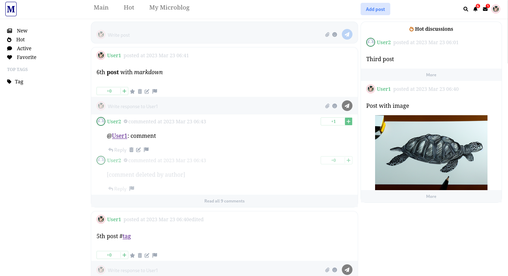

# Microblog

## General info
A platform for microblogging written in Java + Spring (backend) and Typescript + Angular (frontend).



## Table of contents
* [General info](#general-info)
* [Technologies](#technologies)
* [Setup](#setup)
* [Features](#features)

## Technologies
Project is created with:
* Java
* Spring Boot 
* Typescript
* Angular
* PostgreSQL

Additional libraries (backend):
* Lombok
* Jjwt library for JWT tokens
* RestAssured for testing

Additional libraries (frontend):
* ngx-markdown

## Setup
In order to run project you need to clone this repository and build project with Docker Compose:
```
$ git clone https://github.com/xpakx/Micro.git
$ cd ladder
$ docker-compose up --build -d
```

To stop:
```
$ docker-compose stop
```

## Features
- [x] Posts
	- [x] Viewing new posts
	- [x] Viewing top posts
	- [x] Viewing most commented posts
	- [x] Creating posts
	- [x] Editing posts
	- [x] Deleting posts
	- [x] Attaching images to posts
- [x] Comments
	- [x] Viewing comments for post
	- [x] Viewing two newest comments for each post
	- [x] Creating comments
	- [x] Editing comments
	- [x] Deleting comments
	- [x] Attaching images to comments
- [x] Likes & favs
	- [x] Liking posts
	- [x] Liking comments
	- [x] Adding posts to favorites
	- [x] Adding comments to favorites
- [x] User accounts
	- [x] Creating account
	- [x] Login
	- [x] Following users
	- [x] Uploading avatars
	- [x] Updating user datas
- [x] Tags
	- [x] Following tags
	- [x] Tagging posts
	- [x] Tagging comments
- [x] Notifications
	- [x] Mentions
	- [x] Private messages
	- [x] Viewing notifications
	- [x] Deleting notifications
- [x] Moderation
